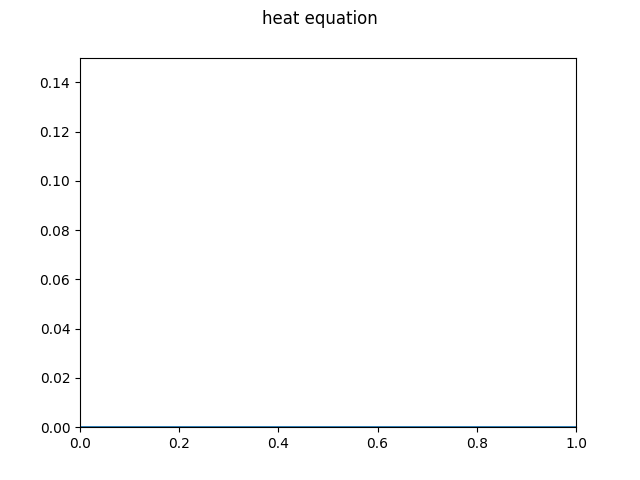
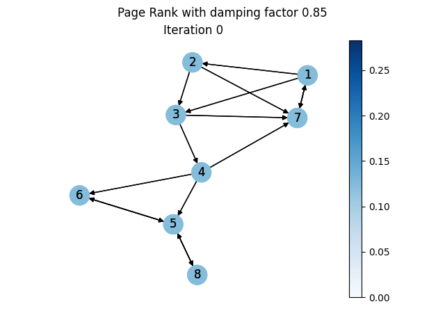
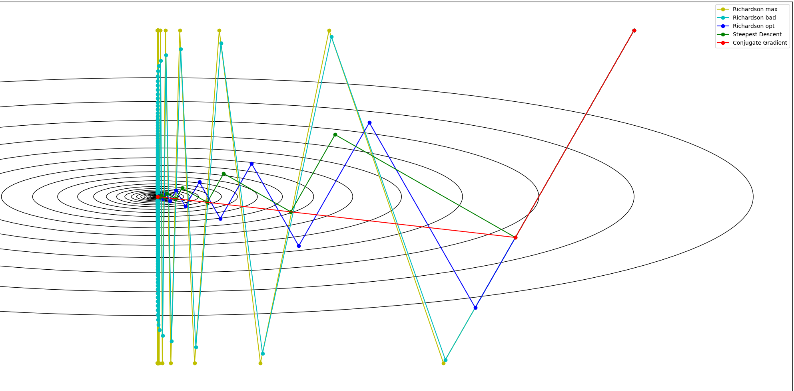

**(Under Development)**

# Python Project: Richardson Iteration from Scratch applied to Heat Equation and the PageRank

- This repo contains material for a 5 days project based Python course: small tutorials (lead sheets for in-class development, in german), the corresponding instructions (below) and some worked examples.
  
- In this project we will implement the [Richardson iteraton](https://en.wikipedia.org/wiki/Modified_Richardson_iteration) from scratch, which is an iterative solver for linear systems $Ax=b$ given by

```math
x^{k+1} = x^k - \theta\cdot(Ax^k - b),~~~~\theta > 0~\text{small}.
```

- Among others, we will implement our own classes for vectors and CSR matrices and overload common operators such as `+, -, *, /, @`.
  
- Our examples will include


| **Heat equation**                                            | **PageRank**                                                 | **Optimization**                                             |
| :----------------------------------------------------------- | ------------------------------------------------------------ | ------------------------------------------------------------ |
| *Richardson as explicit Euler*                               | *Richardson as power iteration*                              | *Richardson as gradient descent*                             |
|  |  |  |

## Objectives

- **Richardson iteration** as an example for an iterative solver
  - Understand strength of an iterative solver in combination with **sparse formats** (here CSR)
  - Examples: **heat equation**, **PageRank**, **gradient descent**
- tools
  - **ssh**, keys
  - **git** and **github**
- Python language
  - Build own data types via **classes** and **operator overloading**
  - software project and **modularity**
  - **`networkx`**: load real data into python, plot graphs
  - **virtual environment**
  - **PyCharm**
  - Software tests with **`pytest`**
  - Intro to SciPy Stack (**NumPy**, **SciPy**, **matplotlib**)
  - **`tabulate`**
- Code documentation with **sphinx**
  - **docstrings** formats
  - publish via github pages
- Clean code
  - **PEP 8**
  - **`black`**
  - **`pre-commit`**
- **LaTex**

## Syllabus

| Time      | start | end   | Content                                                      | Section | Instructions                                         |
| :-------- | ----- | ----- | ------------------------------------------------------------ | ------- | ---------------------------------------------------- |
| **Day 1** |       |       |                                                              |         |                                                      |
| Session 1 | 10:00 | 13:30 | Mathematical Background I                                    | 1.1-1.4 | --                                                   |
| Session 2 | 13:30 | 14:00 | Project planing                                              | 2       | [plan](#plan-modularity)                             |
| Session 3 | 14:00 | 15:30 | ssh, working remote, ssh keys                                | 3       | [ssh](#secure-shell-(ssh))                           |
| **Day 2** |       |       |                                                              |         |                                                      |
| Session 1 | 10:00 | 12:00 | git, github                                                  | 4       | [git](#initialize-a-git-repository)                  |
| Session 2 |       |       | Working Environment and Implementation                       | 5       | [pycharm](#Working-Environment:-The IDE-PyCharm)     |
| Session 3 |       |       | Clean Code, Formatting and pre-commit hooks                  | --      | [clean code](#clean-code,-formatting-and-pre-commit) |
| Session 4 |       |       | Software Tests                                               | --      | --                                                   |
| **Day 3** |       |       |                                                              |         |                                                      |
| Session 1 |       |       | Code Documentation with Sphinx                               | 6       |                                                      |
| Session 2 |       |       | Implementation:  `linalg`, `iterative_solver`, `example` (Heat Equation 1d) | --      |                                                      |
| **Day 4** |       |       |                                                              |         |                                                      |
| Session 1 |       |       | Mathematical Background II: PageRank                         | 1.5     |                                                      |
| Session 2 |       |       | Implementation: Pagerank utilities and Examples              | --      |                                                      |
| Session 3 |       |       | (Misc: License, readme, docs,...)                            | --      |                                                      |
| **Day 5** |       |       |                                                              |         |                                                      |
| Session 1 |       |       | Project presentations                                        |         |                                                      |
| Session 2 |       |       | (SciPy Stack)                                                |         |                                                      |
|           |       |       | (note on exam)                                               |         |                                                      |

## License

The Latex code and the Python sample programs are licensed under [GPL-3.0](https://github.com/cvollmann-teaching/richardson-pagerank/blob/main/LICENSE) and the content of the lecture notes is licensed under [CC-BY-SA 4.0](https://creativecommons.org/licenses/by-sa/4.0/).


## Secure Shell (SSH)

1. Find out the IP or hostname of your neighbor's computer and log in via

   ```bash
   ssh [USERNAME]@[IP_ADDRESS or HOSTNAME]
   ```

2. **Generate ssh keys**

   ```bash 
   ssh-keygen -t ed25519 -f [FILENAME] -C "your_email@example.com"
   ```

    - e.g., `FILENAME=.ssh/github`

    - Use mail address which you will later use for your GitHub account

    - Use a strong passphrase to encrypt your private key

    - Checkout the files

      ```bash
      cd ~/.ssh
      ls -al
      cat [FILENAME]
      ```

   Validate key

   ```bash
   ssh-keygen -y -f [FILENAME]
   ```

   Enter passphrase and it should print the content of the public key in  `FILENAME.pub`

3. **Copy public key to remote**

   ```bash
   ssh-copy-id -i [FILENAME] [IP_ADDRESS or HOSTNAME]	
   ```

   or

   ```bash
   cat [FILENAME] | ssh [USERNAME]@[IP_ADDRESS or HOSTNAME] 'cat >> ~/.ssh/authorized_keys'
   ```

   Now login again via

   ```bash
   ssh [USERNAME]@[IP_ADDRESS or HOSTNAME]
   ```

   You should now provide the passphrase instead of the password

## VCS: git and GitHub

1. **git**: familiarize with git on your local machine
   1. useful shell commands and tools: `mkdir, cd, ls, mv, rm, man, nano`
   2. initialize git repo `a`: `git init`
      1. add and edit files and play with: `git status, git add, git commit, git log, git checkout`...
      2. `.gitignore`

   3. initialize git repo `b`:  
      1. set repo `a` as remote and upstream repo: `git branch`
      2. `git push, git pull`

   4. clone repo `a` : `git clone`

2. **GitHub**
   1. get account
   2. set up ssh keys
   3. create repo
   4. local machine: git clone
   5. .gitignore


## Plan modularity

```bash
|-- code
    |-- data
    |-- docs
    |-- src
    |   |-- linalg.py
    |   |-- iterative_methods.py
    |   |-- utils.py
    |-- examples
    |   |-- heat_equation.py
    |   |-- pagerank.py
    |   |-- gradient_descent.py
    |-- tests
    |   |-- test_csr.py
    |-- output
    |-- main.py
    |-- README.md
    |-- LICENSE
    |-- requirements.txt
    |-- .git
    |-- .idea
```

## Working Environment: The IDE PyCharm

1. Get **educational account** with JetBrains: https://www.jetbrains.com/shop/eform/students
2. **Install PyCharm** (Professional
   edition): https://www.jetbrains.com/help/pycharm/installation-guide.html
3. Set up a **PyCharm Project**: https://www.jetbrains.com/help/pycharm/setting-up-your-project.html
    - Open the directory `code`using the application PyCharm or to play around create any
      other project.
   
4. Overview on **Project Files:** https://www.jetbrains.com/help/pycharm/setting-up-your-project.html
5. Set up **virtual environment**: https://www.jetbrains.com/help/pycharm/creating-virtual-environment.html
   
    - Optional: You may want to inherit site-packages from local Python installation
    - Install some packages
    - Add it to `.gitignore`
6. **Run Code**: https://www.jetbrains.com/help/pycharm/running-without-any-previous-configuring.html
    - Familiarize with Python and run some code.
    - Create a Run Configuration
7. Use the **Debugger**: https://www.jetbrains.com/help/pycharm/debugging-code.html
8. Sync **`requirements.txt`**: https://www.jetbrains.com/help/pycharm/managing-dependencies.html
    - Tools| Sync Python requirements
    - Import some package and update the `requirements.txt`. Did it work?
9. **git** in PyCharm
    - https://www.jetbrains.com/help/pycharm/set-up-a-git-repository.html#e1c9b3f9
    
10. Check out the hidden project directory `.idea`
- Add it to `.gitignore`

11. Further reading:

    - pytest: https://www.jetbrains.com/help/pycharm/pytest.html

       - seek and destroy: https://www.jetbrains.com/help/pycharm/auto-completing-code.html


       - refactor https://www.jetbrains.com/help/pycharm/refactoring-source-code.html


       - Code Completion https://www.jetbrains.com/help/pycharm/auto-completing-code.html


       - Console https://www.jetbrains.com/help/pycharm/working-with-consoles.html


       - Local History https://www.jetbrains.com/help/pycharm/local-history.html


       - Compare Files https://www.jetbrains.com/help/pycharm/comparing-files-and-folders.html


       - Code Inspection https://www.jetbrains.com/help/pycharm/code-inspection.html

## Clean Code, Formatting and Pre-Commit

1. Revisit the PEP 8 Style Guide: https://www.python.org/dev/peps/pep-0008/
2. Use meaningful, self-documenting names.
3. Use inline comments only when necessary.
4. Use docstrings in a consistent format (NumPy, Google, reStructuredText) for all functions and objects.
5. Checkout code inspection options in PyCharm: https://www.jetbrains.com/help/pycharm/tutorial-code-quality-assistance-tips-and-tricks.html#ddc30fc6
6. Checkout the Python formatter: `black`
7. Checkout `pre-commit` hooks, install and use it.

## Implement class `vector`

In `src/linalg.py`:

1. Inherit from `list`

   ```python
   class vector(list)
   ```

   We use mutable data type `list()`over `tuple()`as we will later manipulate entries in the vector.
   
2. Overload the operators `+, -, @` and `*` by implementing the following magic methods which all expect another vector- or scalar-type say `other`:
    - `__add__(self, other)` ($x+y$)
    - `__sub__(self, other)` ($x-y$)
    - `__matmul__(self, other)` ($x^Ty$)
    - `__mul__(self, other)` ($\alpha \cdot x$)
    - `__rmul__(self, other)` ($x\cdot\alpha $)
    - Side remark: Also See Level 1 BLAS Routines:
        - https://de.wikipedia.org/wiki/Basic_Linear_Algebra_Subprograms
        - http://www.netlib.org/blas
   
3. Write appropriate test files `test_*.py` which you put into the directory `tests`

    - Create Run Configuration for your tests

## Implement p-Norm

In `src/linalg.py`:

1. Implement a function `norm(x, order=2)` which expects a vector `x` and computes its $p$-Norm:

$$
\mathbb{R}^n \to [0,+\infty),~x \mapsto \|x\|_2 := \left({\sum_{i=1}^n |x_i|^p}\right)
^{\frac{1}{p}}
$$

## Implement class `csr_matrix`

In `src/linalg.py`:

1. initialize with CSR-Format (Compressed Sparse Row) tuple `(data, indices,indptr)` and `shape`. Implement at least the following attributes: `data, indices, indptr, shape`. You can start with the following code snippet.
   
   ```python
   class csr_matrix:
       """
       CSR matrix class
       ...
       """
       def __init__(self, csr_tuple, shape=None):
           _data, _indices, _indptr = csr_tuple
           self.data = _data
           self.indices = _indices
           self.indptr = _indptr
   ```
   
2. Implement magic methods:
    1. `__matmul__(self, x : vector) -> vector`

    - This magic method expects a vector `x` and computes the matrix--vector product $A\cdot x$. By operator overloading, for an object `A`  of the class `csr_matrix` we then have:
    - `A @ x = A.__matmul__(x)`
    - For simplicity we neglect the capability of evaluating also the matrix--matrix product.
    - Side remark: This next level of complexity can be classified into Level 2 BLAS routines:
        - https://de.wikipedia.org/wiki/Basic_Linear_Algebra_Subprograms
        - http://www.netlib.org/blas
    
    2. `__toarray__(self, col_dim)`
        - A method which outputs a list with the rows of the matrix (again as a list).
    
3. Write appropriate test files `test_*.py` which you put into the directory `tests`

    - Create Run Configuration for your tests

## Implement helper function `csr_tridiag_toep(n, data)`

In `src/linalg.py`:

In order to run some examples later on, it would be nice to have a function which creates certain CSR-tuples. For matrices with some particular structure  the CSR-lists can be easily obtained. In fact, we implement a function which builds [tridiagonal Toeplitz matrices](https://de.wikipedia.org/wiki/Tridiagonal-Toeplitz-Matrix).

1. Implement a function

  ```python
  csr_tridiag_toep(n : int, data : tuple) -> csr_matrix
  ```

that automatically instantiates an object `A`of the above class `csr\_matrix` for a tridiagonal matrix whose diagonals are constant:

```math
  \begin{pmatrix}
  b & c  &0   & \cdots   & 0 \\
  a &  b & c  &    &   \vdots \\
  0&  \ddots &  \ddots &\ddots  &0  \\
  \vdots  &    &  a &  b & c  \\
  0 &   \cdots  & 0& a  &  b \\
  \end{pmatrix}\in \mathbb{R}^{n \times n}.
```

- Accordingly, the parameter `n` specifies the dimension of the square matrix and the parameter `data` contains the corresponding diagonal entries in the form of a tuple `data = (a,b,c)`.
  
- First consider how the three CSR- lists `data, indices, indptr` look like for general parameters `(n, data)` and then implement them as a function depending on `(n, data)`. For instantiation, you then just need to pass these three lists to the constructor of the above class `csr\_matrix`.

2. Write appropriate test files `test_*.py` which you put into the directory `tests`

    - Create Run Configuration for your tests

## Implement Richardson iteration

In `src/iterative_solver.py`:

1. Implement the relaxed Richardson iteration

   $$
   x_{k+1} = x_k - \theta (Ax_k -b)
   $$

   as a function

   ```python
   x, error, numiter = richardson(A : csr_matrix, b : vector, x0 : vector, theta=.1, maxiter=500, tol=1e-08) --> (vector, list, int)
   ```

   which expects as input

    - `A` : invertible matrix in $\mathbb{R}^{n\times n}$ as object of class *
      *`csr_matrix`**

    - `b` : rhs in $\mathbb{R}^n$ as object of class `vector` of size $n$

    - `x0` : initial guess in $\mathbb{R}^n$ as object of class `vector` of size $n$

    - `theta` : relax. parameter/stepsize $\theta$ as `float`

    - `maxiter` : maximal number of iterations as `int`

    - `tol` : error tolerance as `float`

   and outputs

    - `x` : the last iterate (approxiamte solution) as object of class `vector` of size
      $n$

    - `error` : Python list of all residuals $\|Ax_k-b\|_2$

    - `numiter` : number of iterations that have been performed

   The procedure should terminate as soon as the residual is sufficiently small, i.e.
   $\|Ax_k-b\|_2 < \texttt{tol}$ or the maximum number `maxiter` of iteration steps is
   reached.

2. Write appropriate test files `test_*.py` which you put into the directory `tests`

    - Create Run Configuration for your tests

See also LAPACK built on BLAS: https://de.wikipedia.org/wiki/LAPACK

## Run first examples: 1d Heat Equation

1. **Heat Equation**

   Solve $A_1x =b$, with

```math
A_1 = n^2 \begin{pmatrix}
2 & -1  &0   & \cdots   & 0 \\
-1 &  2 & -1  &    &   \vdots \\
0&  \ddots &  \ddots &\ddots  &0  \\
\vdots  &    &  -1 &  2 & -1  \\
0 &   \cdots  & 0& -1  &  2 \\
\end{pmatrix}\in \mathbb{R}^{n \times n},
~~~b = \begin{pmatrix}
1 \\
\\
\vdots  \\
\\
1  \\
\end{pmatrix} \in \mathbb{R}^{n},
~~~x_0 =  \begin{pmatrix}
0 \\
\\
\vdots  \\
\\
0  \\
\end{pmatrix}\in \mathbb{R}^{n},
```

for different dimensions $n$ (should be a parameter in your config script).

2. **Regularized Heat Equation**

   Replace $A_1$ in the above example with

$$
A_2 = A_1 + \delta I
$$

for $\delta > 0$ and $I \in \mathbb{R}^{n\times n}$ the identity matrix. Run your examples from 1. again with different $\delta$. Observe the number of iterations needed as $\delta$ increases. What about the convergence now?

**Remarks:**

- Put the configuration for these examples in `examples/example1.py` etc. and run your examples in `main.py` where you mainly call the function `richardson`with the input parameters defined in the example files.
  
- If your method does not converge, try it with a (very) small relaxation parameter $\theta$ and a large
  maximum number of iterations `maxiter`. The matrix $A_1$ above is "ill-conditioned" and the Richardson method may need (very!) many iterations to achieve a sufficiently small error. For matrix $A_2$, on the other hand, you should observe a significant improvement for increasing $\delta$.
  
- The matrices $A_1$ and $A_2$ are respectively tridiagonal--Toeplitz- matrices. So you can use your `csrTridiagToep` function from above to instantiate the `csr_matrix` class.
  
- You will recognize the matrix $A_1$ later as a finite-difference discretization of the one-dimensional Poisson equation on regular grids with homogeneous Dirichlet boundary values. And the matrix $A_2$ as a Tikhonov-regularization of it.

## Utils

In `src/utils.py`:

Implement:

1. A function to plot a univariate function (in our case the vector of residuals `error`) using `matplotlib.pyplot`. 
   
    - matplotlib.pyplot.savefig()
   
2. Optional: A function that uses the Python package `tabulate`to generate a LaTex table into an external text file with two columns being iteration number and corresponding entry in the residual vector `error` that you can import later on into your paper. (Optional third column would be the rate of convergence)

## Utils for PageRank

1. Recommended Reading: [Deeper Inside PageRank](https://www.stat.uchicago.edu/~lekheng/meetings/mathofranking/ref/langville.pdf) by Langville and Meyer.

2. create a script `src.pagerank_utils` (or similar)

   1. Read edgle list into scipy sparse csr

   1. Normalize rows

   1. Deal with dangling nodes (pdf pages or similar)

   1. Implement google_matrix as class with correct matmul

   1. For richardson: Implement a second version with the following adatption

3. Combine everything:

   1. Write appropriate test files `test_*.py` which you put into the directory `tests`

   2. Create Run Configuration for your tests

   3. Optional: Write further utils to draw the graphs, create a video, ...


## Compute the PageRank

1. **PageRank of your own Graph**
    1. Draw your own small and write the corresponding list of edges
       textfile: `examples/pagerank_small.edges`
    2. Create an example config like `example/pagerank_small`
    
2. **Download real data:** https://networkrepository.com/web.php

## Implement the Power Iteration (optional)

1. Implement a function `power_iteration(A,...)`
2. Re-run your Page-Rank using the power iteration and the Google matrix.

## Code Documentation with Sphinx

1. Consult the official documentation: https://www.sphinx-doc.org/en/master/index.html

2. Generate an html documentation of your code using `sphinx`. Implement at least the
   following points:

    - Deliberately choose an `html_theme`

    - At a minimum, use the following directives:

        - `.. toctree::`

        - `.. autosummary::`

        - `.. code-block::`

        - `.. autofunction::`

        - `.. autoclass::`

        - `.. math::`

    - Use the extension `sphinx.ext.viewcode`

    - Create at least one more subpage and link to it.

    - Use consistent docstrings in a fixed format.
3. Use github pages to expose your documentation.
4. Link your documentation later on in your paper.

## Software Packaging (optional)

create a python package.

## Write a Paper with LaTeX (optional)

### Resources

- Read the Overleaf Tutorials by starting here: https://www.overleaf.com/learn/latex/Learn_LaTeX_in_30_minutes
- Short textbook: https://dante-ev.github.io/l2kurz/l2kurz.pdf

### Warmup: LaTeX via Command Line

1. In the home directory:\
   Create a .tex script with an editor, e.g., nano

   `$ nano text.tex`

   and insert a few LaTeX commands. Minimal example:

   ```latex
   \documentclass{article}
   \begin{document}
   \section{My First LaTex Document}
   % content
   \end{document}
   ```

1. apply LaTeX compiler, here `pdflatex`, to this file

   `$ pdflatex text.tex`

1. view file in terminal e.g. via

   `$ less text.pdf`

   or, if X-Window is available, view with a pdf viewer, e.g:

   `$ xdg-open text.pdf`

### Working Environment: The IWE TexStudio

1. Install <https://www.texstudio.org/#Download>

2. Now perform the steps from above using TexStudio instead of the command line.

### Plan Modularity

For example:

```bash
|-- text/
    |-- src/
    |   |-- macros/
    |   |   |-- meta.tex
    |   |   |-- usepackages.tex
    |   |   |-- style.tex
    |   |   |-- commands.tex
    |   |   |-- ...
    |   |-- content/
    |   |   |-- abstract.tex
    |   |   |-- introduction.tex
    |   |   |-- section1.tex
    |   |   |-- section2.tex
    |   |   |-- listing.py
    |   |   |-- ...
    |-- media/
    |   |-- picture.png
    |   |-- picture.jpg
    |   |-- ...
    |-- literature/
    |   |-- literature.bib
    |   |-- pdfs/
    |   |   |-- book.pdf
    |   |   |-- paper.pdf
    |   |   |-- ...
    |-- main.tex
```

1. `<PATH>/meta.tex`

    - Set at least the following variables:\
      `\title{<projectName>}`
      `\author{name}` with `\thanks{}`
      `\date{year (, date, today)}`

2. `<PATH>/usepackages.tex`

    - here you can load all needed packages
    - `\usepackage[ngerman]{babel}`...

3. `<PATH>/style.tex`

    - Here you can configure everything that influences the appearance of the text.
      of the text.

    - Examples: Colors, theorem environments, links,\....

4. `<PATH>/commands.tex`

    - Here all defined constructs can be collected centrally.

5. `<PATH>/literature.bib`

    - In this database the literature is collected.

    - Set at least one entry here, which will then be cited in the text.

    - In the directory `<PATH>/literature/` the pdf files can be stored for example.

6. `<PATH>/abstract.tex`

    - Write a small abstract of your essay. \...

7. `<PATH>/<content>.tex`

    - Here we write the actual content.
    - The content can again be distributed to several building blocks.
    - quote at least one bib entry

8. `<PATH>/main.tex`

    - main input file with the help of which we glue everything together.
    - import .tex building blocks via (or , ,\...)
    - Title page with abstract
    - Table of Content
    - List of Figures with at least one entry (create at least one graphic)
    - List of Tables with at least one entry (create at least one table)
    - Bibliography with at least one entry (cite at least one textbook that fits the
      project)

    - Example:

      ```latex
      \documentclass{article} % mandatory start of a .tex file; determines type of text
      % Preamble: Load packages, ...
      \input{<PATH>/usepackages}
      \input{<PATH>/meta}
      \input{<PATH>/style}
      \input{<PATH>/commands}
      \input{....}
      %
      \begin{document}
      % TITLEPAGE with ABSTRACT
      \maketitle
      \input{<PATH>/abstract}
      % ToC, LoF, LoT
      \pagestyle{empty}
      \newpage\tableofcontents
      \newpage\listoffigures
      \newpage\listoftables
      \newpage
      % CONTENT
      \pagenumbering{arabic}
      \pagestyle{plain}
      \input{<PATH>/Content1}
      % ...
      % BIBLIOGRAPHY
      \newpage
      \bibliographystyle{plain}
      \bibliography{<PATH>/literature.bib}
      %
      \end{document} % everything after this command is ignored by LaTex
      ```

### Write a Small Paper

1. Write a short mathematical paper using LaTeX about the Richardson method and present
   your numerical results. Modularize your LaTeX project in a meaningful way and implement
   the minimum requirements mentioned above.

## Run your examples with Scipy Stack (optional)

1. Instead of using your own classes for vectors and csr_matrices you can use the
   
   ###### respective data types from the SciPy Stack and re-run your experiments.
